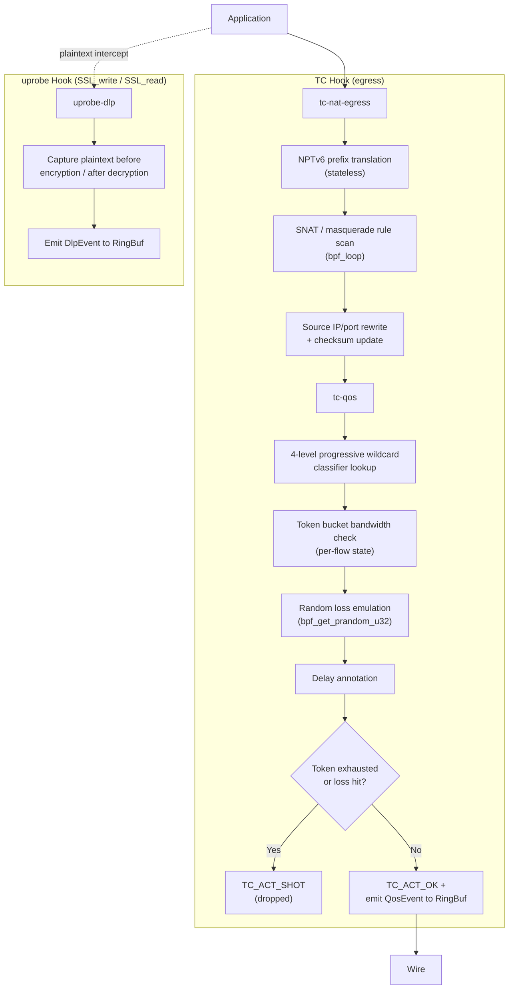
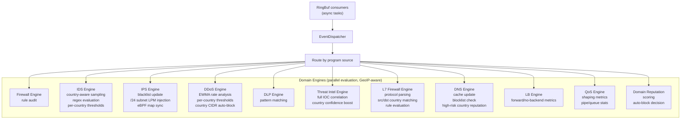
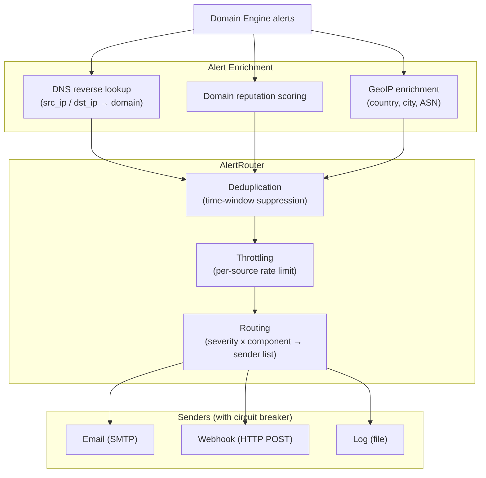
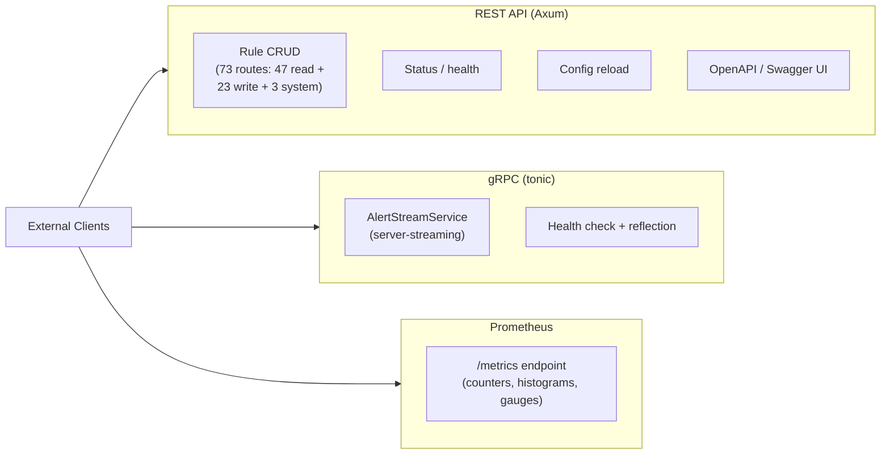
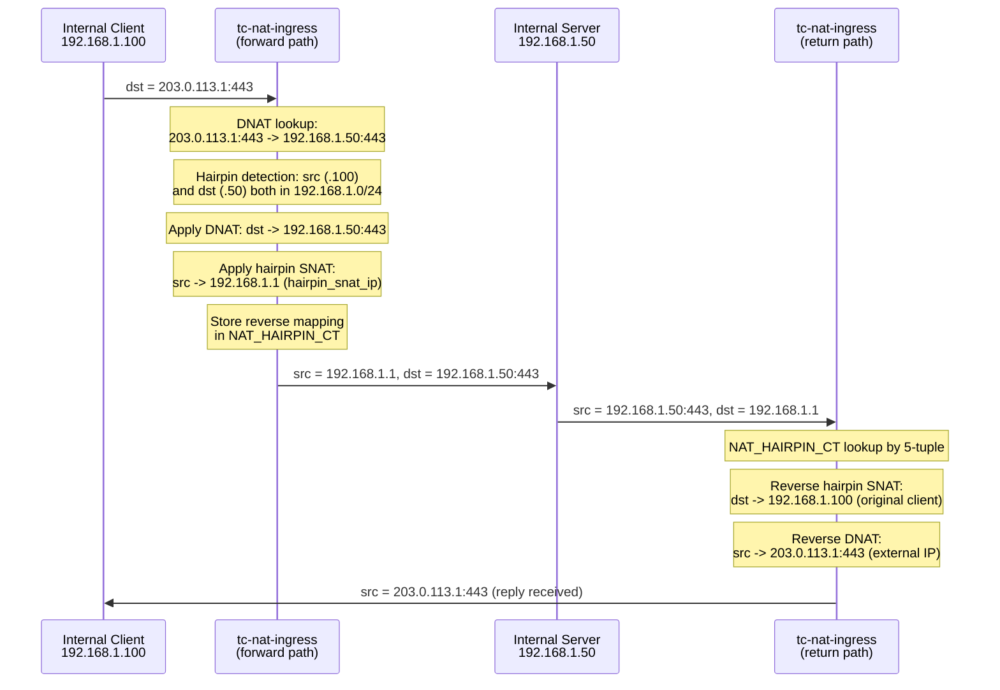
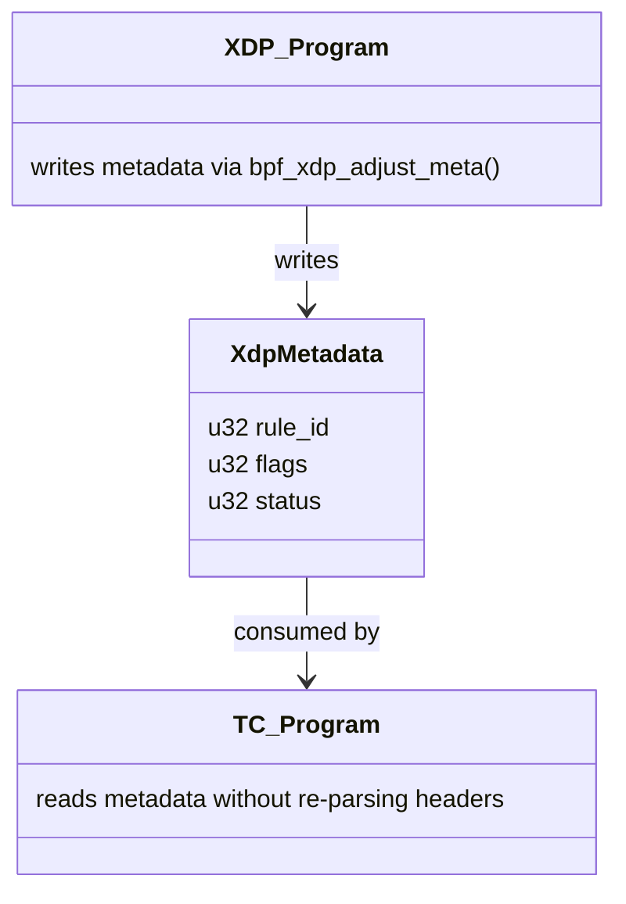

# Data Flow

## Packet Processing Pipeline

### 1. Ingress (Kernel)

```mermaid
flowchart TD
    NIC["Network Interface"]

    subgraph XDP["XDP Hook (earliest possible)"]
        FW["xdp-firewall"]
        FW_LPM["LPM trie lookup\n(CIDR rules)"]
        FW_SCAN["Linear scan\n(port/protocol/VLAN)"]
        FW --> FW_LPM --> FW_SCAN

        FW_DENY{"Denied?"}
        FW_SCAN --> FW_DENY
        FW_DROP_1["XDP_DROP"]
        FW_DENY -- Yes --> FW_DROP_1

        FW_REJECT{"ACTION_REJECT?"}
        FW_DENY -- No --> FW_REJECT
        REJECT_PROG["xdp-firewall-reject\n(tail_call slot 1)"]
        FORGE_RST["Forge TCP RST /\nICMP Unreachable"]
        XDP_TX_1["XDP_TX\n(sent back)"]
        FW_REJECT -- Yes --> REJECT_PROG --> FORGE_RST --> XDP_TX_1

        FW_PASS["XDP_PASS +\nemit RingBuf event"]
        FW_REJECT -- No --> FW_PASS

        RL_ABSENT{"ratelimit\npresent?"}
        FW_PASS --> RL_ABSENT

        subgraph RATELIMIT["xdp-ratelimit (tail_call slot 0)"]
            RL_LPM["Country LPM tier lookup\n(RL_LPM_SRC_V4/V6)"]
            RL_DDOS["DDoS protections\n(SYN/ICMP/UDP amp/conntrack)"]
            RL_LPM --> RL_DDOS

            SYN_FLOOD{"SYN flood?"}
            RL_DDOS --> SYN_FLOOD
            SYNCOOKIE["xdp-ratelimit-syncookie\n(tail_call)"]
            FORGE_SYNACK["Forge SYN+ACK cookie"]
            XDP_TX_2["XDP_TX\n(sent back)"]
            SYN_FLOOD -- Yes --> SYNCOOKIE --> FORGE_SYNACK --> XDP_TX_2

            RL_CHECK["Per-IP rate check\n(PerCPU hash)"]
            SYN_FLOOD -- No --> RL_CHECK

            RL_EXCEEDED{"Rate exceeded\nor DDoS?"}
            RL_CHECK --> RL_EXCEEDED
            RL_DROP["XDP_DROP"]
            RL_EXCEEDED -- Yes --> RL_DROP
        end

        RL_ABSENT -- Yes --> RL_LPM

        subgraph LB["xdp-loadbalancer"]
            LB_LOOKUP{"Service\nmatch?"}
            LB_DNAT["DNAT → XDP_TX /\nXDP_REDIRECT"]
            LB_PASS_2["XDP_PASS"]
            LB_LOOKUP -- Yes --> LB_DNAT
            LB_LOOKUP -- No --> LB_PASS_2
        end

        RL_EXCEEDED -- No --> LB_LOOKUP
        RL_ABSENT -- "No (slot 2)" --> LB_LOOKUP
    end

    NIC --> FW

    STACK["Kernel Network Stack\n(SKB allocation)"]
    LB_PASS_2 --> STACK

    subgraph TC["TC Hook (ingress classifier)"]
        CT["tc-conntrack"]
        CT_SM["TCP/UDP/ICMP state machine"]
        CT_BI["Bidirectional connection tracking\n(shared CT_TABLE)"]
        CT --> CT_SM --> CT_BI

        SCRUB["tc-scrub"]
        SCRUB_NORM["TTL / MSS / DF / IP ID\nnormalization"]
        SCRUB_TS["TCP timestamp stripping"]
        CT_BI --> SCRUB --> SCRUB_NORM --> SCRUB_TS

        NAT_IN["tc-nat-ingress"]
        NAT_NPTV6["NPTv6 prefix translation\n(stateless)"]
        NAT_DNAT["DNAT rule scan (bpf_loop)\n+ hairpin NAT"]
        NAT_CSUM["L3/L4 checksum update"]
        SCRUB_TS --> NAT_IN --> NAT_NPTV6 --> NAT_DNAT --> NAT_CSUM

        IDS["tc-ids"]
        IDS_SAMPLE["Sampling\n(bpf_get_prandom_u32)"]
        IDS_L7["L7 detection\n(bpf_strncmp)"]
        IDS_EMIT["Emit PacketEvent\nto RingBuf"]
        NAT_CSUM --> IDS --> IDS_SAMPLE --> IDS_L7 --> IDS_EMIT

        TI["tc-threatintel"]
        TI_BLOOM["Bloom filter pre-check"]
        TI_VLAN["VLAN quarantine\n(bpf_skb_vlan_push)"]
        TI_EMIT["Emit PacketEvent\nto RingBuf"]
        IDS_EMIT --> TI --> TI_BLOOM --> TI_VLAN --> TI_EMIT

        DNS["tc-dns"]
        DNS_UDP["UDP:53 identification"]
        DNS_EMIT["Emit DNS packet\nto RingBuf"]
        TI_EMIT --> DNS --> DNS_UDP --> DNS_EMIT
    end

    STACK --> CT
```

### 1b. Egress (Kernel)

### 2. Event Dispatch (Userspace)

### 3. Alert Pipeline

### 4. External Interfaces

## Hairpin NAT Data Flow

When an internal client accesses a DNAT service via the external IP, and both client and server are on the same internal subnet:

## XDP→TC Metadata Flow

When XDP passes a packet, it writes metadata using `bpf_xdp_adjust_meta`:

This avoids duplicate header parsing across hook points.

## eBPF↔Userspace Map Synchronization

Some eBPF maps are updated from userspace:

| Map | Direction | Purpose |
|-----|-----------|---------|
| Firewall LPM tries | Userspace → Kernel | Rule updates |
| Rate limit configs | Userspace → Kernel | Policy changes |
| Rate limit country LPM (×2) | Userspace → Kernel | GeoIP country tier reload |
| Rate limit tier configs | Userspace → Kernel | Country tier config reload |
| DDoS protection configs | Userspace → Kernel | SYN/ICMP/amp thresholds, conntrack settings |
| Syncookie secret | Userspace → Kernel | 32-byte FNV-1a secret for SYN cookie generation |
| Conntrack tables (CT_TABLE_V4/V6) | Kernel ↔ Kernel | Shared via pinning between xdp-firewall and tc-conntrack |
| XDP PROG_ARRAY | Userspace → Kernel | Tail-call wiring: firewall → ratelimit/reject/loadbalancer |
| Threat intel Bloom filter | Userspace → Kernel | IOC feed refresh |
| Threat intel LRU hash maps | Userspace → Kernel | IOC exact-match confirmation |
| IPS blacklist | Userspace → Kernel | Auto-block IPs |
| DNS blocklist | Userspace → Kernel | Domain blocks |
| LB service/backend maps | Userspace → Kernel | Load balancer service definitions |
| LB metrics (PerCpuArray) | Kernel → Userspace | Per-CPU forwarding counters |
| QoS pipe/queue/classifier configs | Userspace → Kernel | QoS policy changes |
| QoS metrics (PerCpuArray) | Kernel → Userspace | Per-CPU shaping counters |
