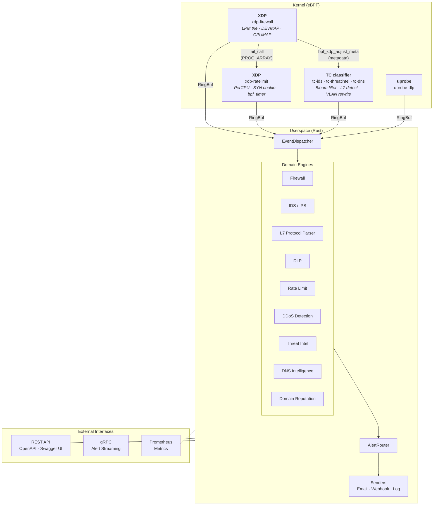

# Architecture Overview

eBPFsentinel is a single-binary agent with two execution layers:

1. **Kernel-space** — 11 eBPF programs attached at XDP, TC, and uprobe hook points
2. **Userspace** — Rust async runtime (Tokio) with domain engines, API servers, and alert pipeline



## Crate Dependency Graph

| Crate | Role | Depends On |
|-------|------|-----------|
| `domain` | Business logic, engines, entities | Nothing |
| `ports` | Trait definitions (primary + secondary) | `domain` |
| `application` | Use cases, pipelines, orchestration | `domain`, `ports` |
| `infrastructure` | Config, logging, metrics | `domain`, `ports` |
| `adapters` | HTTP, gRPC, eBPF, storage (redb) | `domain`, `ports` |
| `agent` | Binary entry point, startup | All crates |

## Project Structure

```
ebpfsentinel/
├── Cargo.toml                        # Workspace root
├── Dockerfile                        # Multi-stage build
├── docker-compose.yml                # Deployment example
├── deny.toml                         # Dependency policy
├── config/
│   ├── ebpfsentinel.yaml             # Default config
│   └── examples/                     # Per-feature standalone configs (12 files)
├── proto/
│   └── ebpfsentinel/v1/alerts.proto  # gRPC service definition
├── crates/
│   ├── ebpf-common/                  # Shared #[repr(C)] types (kernel + userspace)
│   ├── ebpf-programs/                # eBPF kernel programs (nightly, bpfel-unknown-none)
│   │   ├── xdp-firewall/
│   │   ├── xdp-ratelimit/
│   │   ├── tc-ids/
│   │   ├── tc-threatintel/
│   │   ├── tc-dns/
│   │   └── uprobe-dlp/
│   ├── domain/                       # Business logic (engines, entities, errors)
│   ├── ports/                        # Port traits (primary + secondary)
│   ├── application/                  # Use cases, pipelines, orchestration
│   ├── adapters/                     # HTTP, gRPC, eBPF, redb storage
│   ├── infrastructure/               # Config, logging, metrics
│   ├── agent/                        # Binary entry point
│   └── xtask/                        # Build orchestration
├── tests/integration/                # BATS integration tests (15 suites)
├── fuzz/                             # libFuzzer fuzz targets (12 targets)
└── .github/workflows/                # CI/CD pipelines
```

## Key Design Decisions

- **100% Rust** — kernel programs and userspace, no C, no Go
- **Aya framework** — compile-once eBPF with CO-RE/BTF support
- **Hexagonal/DDD** — domain logic has zero external dependencies
- **`#![forbid(unsafe_code)]`** on domain, ports, application, infrastructure crates
- **Single binary** — no sidecar processes, no daemon dependencies
- **Source-agnostic feeds** — threat intel feeds are configured in YAML, no provider-specific code
