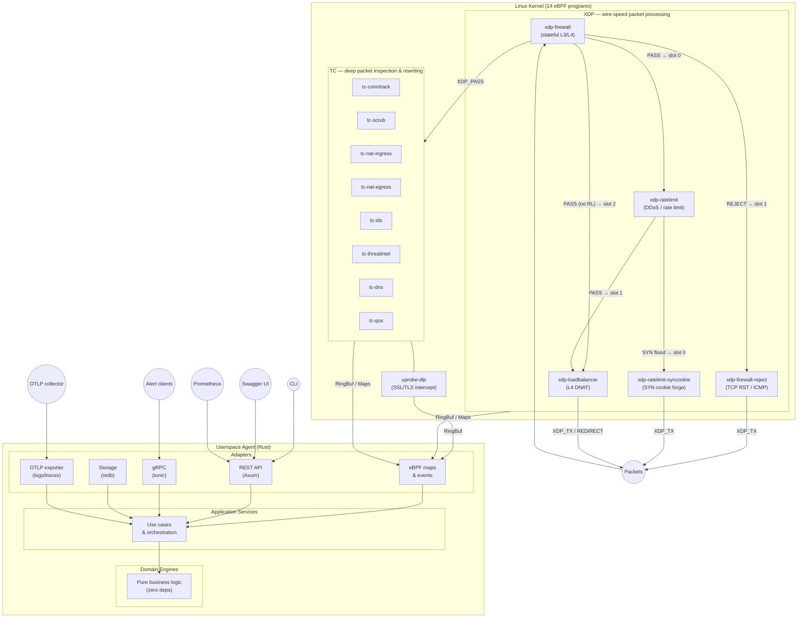

# Architecture Overview

eBPFsentinel is a single-binary agent with two execution layers:

1. **Kernel-space** — 14 eBPF programs attached at XDP, TC, and uprobe hook points
2. **Userspace** — Rust async runtime (Tokio) with domain engines, API servers, and alert pipeline


```mermaid
flowchart TB
    subgraph kernel["Linux Kernel (14 eBPF programs)"]
        direction TB
        subgraph xdp["XDP — wire-speed packet processing"]
            fw["xdp-firewall\n(stateful L3/L4)"]
            fw_rej["xdp-firewall-reject\n(TCP RST / ICMP)"]
            rl["xdp-ratelimit\n(DDoS / rate limit)"]
            rl_sc["xdp-ratelimit-syncookie\n(SYN cookie forge)"]
            lb["xdp-loadbalancer\n(L4 DNAT)"]
        end
        subgraph tc["TC — deep packet inspection & rewriting"]
            ct[tc-conntrack]
            scrub[tc-scrub]
            nat_i[tc-nat-ingress]
            nat_e[tc-nat-egress]
            ids[tc-ids]
            ti[tc-threatintel]
            dns[tc-dns]
            qos[tc-qos]
        end
        uprobe["uprobe-dlp\n(SSL/TLS intercept)"]
    end

    packets(("Packets")) --> fw

    fw -- "PASS → slot 0" --> rl
    fw -- "REJECT → slot 1" --> fw_rej
    fw -- "PASS (no RL) → slot 2" --> lb
    rl -- "SYN flood → slot 0" --> rl_sc
    rl -- "PASS → slot 1" --> lb
    fw_rej -- "XDP_TX" --> packets
    rl_sc -- "XDP_TX" --> packets
    lb -- "XDP_TX / REDIRECT" --> packets

    fw -- "XDP_PASS" --> tc
    tc --- uprobe

    subgraph agent["Userspace Agent (Rust)"]
        direction LR
        subgraph domain["Domain Engines"]
            de["Pure business logic\n(zero deps)"]
        end
        subgraph app["Application Services"]
            as["Use cases\n& orchestration"]
        end
        subgraph adapters["Adapters"]
            ebpf_a["eBPF maps\n& events"]
            http["REST API\n(Axum)"]
            grpc["gRPC\n(tonic)"]
            store["Storage\n(redb)"]
            otlp["OTLP exporter\n(logs/traces)"]
        end
    end

    xdp -- "RingBuf / Maps" --> ebpf_a
    tc -- "RingBuf / Maps" --> ebpf_a
    uprobe -- "RingBuf" --> ebpf_a

    ebpf_a --> as
    as --> de
    http --> as
    grpc --> as
    store --> as

    cli(("CLI")) --> http
    swagger(("Swagger UI")) --> http
    prom(("Prometheus")) --> http
    alerts(("Alert clients")) --> grpc
    otel(("OTLP collector")) --> otlp
    otlp --> as
```

## Crate Dependency Graph

| Crate | Role | Depends On |
|-------|------|-----------|
| `ebpf-common` | Shared `#[repr(C)]` types (kernel + userspace) | Nothing |
| `domain` | Business logic, engines, entities | Nothing |
| `ports` | Trait definitions (primary + secondary) | `domain` |
| `application` | Use cases, pipelines, orchestration | `domain`, `ports` |
| `infrastructure` | Config, logging, metrics | `domain`, `ports` |
| `adapters` | HTTP, gRPC, eBPF, storage (redb), GeoIP | `domain`, `ports` |
| `agent` | Binary entry point, startup | All crates |
| `xtask` | Build orchestration (eBPF multi-program builds) | None |

## Project Structure

```
ebpfsentinel/
├── Cargo.toml                        # Workspace root
├── Dockerfile                        # Multi-stage build
├── docker-compose.yml                # Deployment example
├── deny.toml                         # Dependency policy
├── config/
│   ├── ebpfsentinel.yaml             # Default config
│   └── examples/                     # Per-feature standalone configs (20 files)
├── proto/
│   └── ebpfsentinel/v1/alerts.proto  # gRPC service definition
├── crates/
│   ├── ebpf-common/                  # Shared #[repr(C)] types (kernel + userspace)
│   ├── ebpf-programs/                # eBPF kernel programs (nightly, bpfel-unknown-none)
│   │   ├── xdp-firewall/
│   │   ├── xdp-firewall-reject/
│   │   ├── xdp-ratelimit/
│   │   ├── xdp-ratelimit-syncookie/
│   │   ├── xdp-loadbalancer/
│   │   ├── tc-ids/
│   │   ├── tc-threatintel/
│   │   ├── tc-dns/
│   │   ├── tc-conntrack/
│   │   ├── tc-scrub/
│   │   ├── tc-nat-ingress/
│   │   ├── tc-nat-egress/
│   │   ├── tc-qos/
│   │   └── uprobe-dlp/
│   ├── domain/                       # Business logic (engines, entities, errors)
│   ├── ports/                        # Port traits (primary + secondary)
│   ├── application/                  # Use cases, pipelines, orchestration
│   ├── adapters/                     # HTTP, gRPC, eBPF, redb, GeoIP
│   ├── infrastructure/               # Config, logging, metrics
│   ├── agent/                        # Binary entry point
│   └── xtask/                        # Build orchestration
├── tests/integration/                # BATS integration tests
├── fuzz/                             # libFuzzer fuzz targets
└── .github/workflows/                # CI/CD pipelines
```

## Key Design Decisions

- **100% Rust** — kernel programs and userspace, no C, no Go
- **Aya framework** — compile-once eBPF with CO-RE/BTF support
- **Hexagonal/DDD** — domain logic has zero external dependencies
- **`#![forbid(unsafe_code)]`** on domain, ports, application, infrastructure crates
- **Single binary** — no sidecar processes, no daemon dependencies
- **Source-agnostic feeds** — threat intel feeds are configured in YAML, no provider-specific code
- **MITRE ATT&CK mapping** — every alert tagged with tactic + technique ID
- **GeoIP enforcement** — MaxMind-backed country resolution shared across all engines
- **Hot reload** — configuration updates without restart (file watcher, SIGHUP, or API)
- **JWT/OIDC/API key auth** — role-based access control (Admin, Operator, Viewer)
- **TLS 1.3** — REST and gRPC secured with rustls + aws_lc_rs
- **OTLP export** — alerts as OpenTelemetry Logs to any OTLP-compatible collector
- **CLI** — 26 subcommands covering all endpoints
