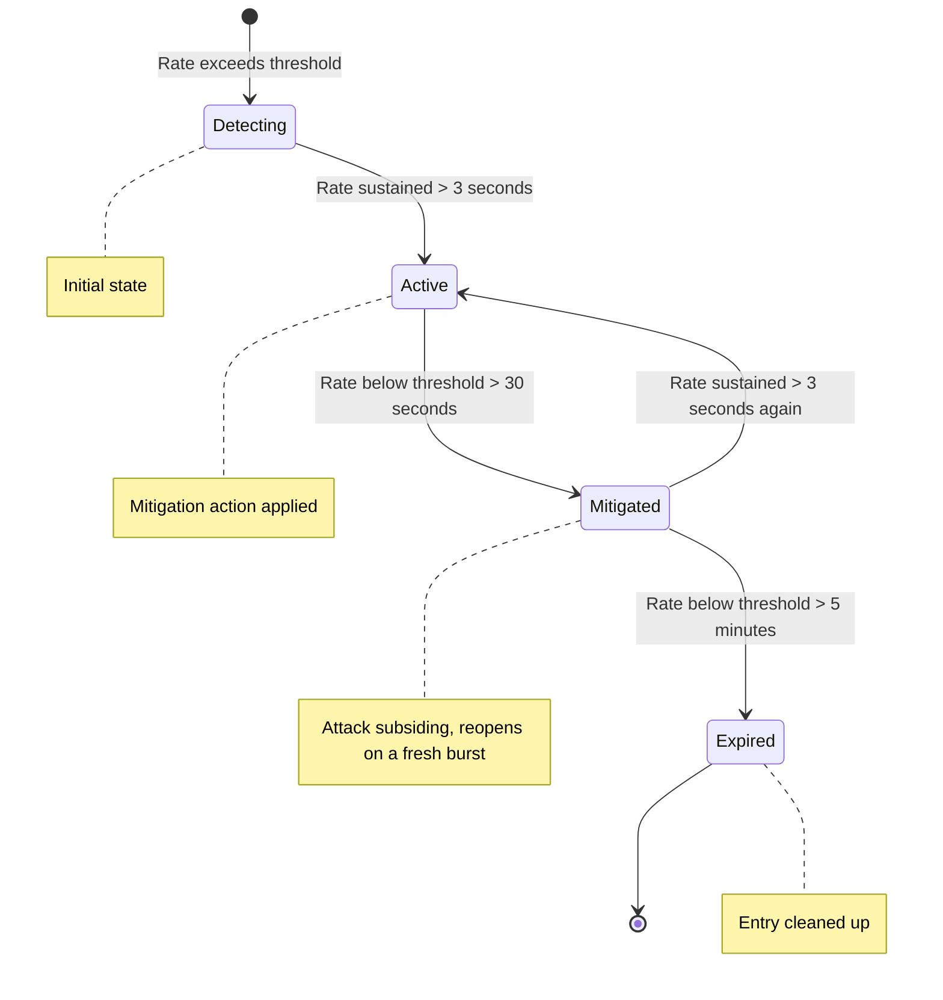

# DDoS Protection

> **Edition: OSS** | **eBPF Program: xdp-ratelimit** | **Domain: ddos**

## Overview

eBPFsentinel provides dedicated DDoS protection combining **kernel-side enforcement** (eBPF/XDP) with **userspace detection** (EWMA-based anomaly detection and attack state machine). This is a separate domain from rate limiting - rate limiting controls per-IP traffic rates, while DDoS protection detects and mitigates coordinated attack patterns.

The two share one kernel program: the guards described below live inside `xdp-ratelimit`, which is only loaded when `ratelimit.enabled` is `true`. DDoS protection therefore requires rate limiting to be enabled, plus at least one guard - policies alone raise nothing, since it is the guards that report the flood a policy measures. The agent refuses to start on a `ddos` section that neither condition satisfies.

## How It Works

### Two-Layer Defense

1. **Kernel-side (eBPF)** - XDP programs enforce immediate protections: SYN rate tracking, ICMP rate limiting, UDP amplification filtering, and TCP connection tracking. These run at wire speed before the kernel allocates an SKB.
2. **Userspace (DDoS Engine)** - Analyzes traffic patterns with Exponentially Weighted Moving Average (EWMA, α=0.3), manages attack state transitions, and applies policy-based mitigation decisions.

### Attack Types

| Attack Type | Detection | eBPF Protection |
|-------------|-----------|-----------------|
| **SYN Flood** | SYN rate exceeds threshold | SYN cookie forging (SYN+ACK via XDP_TX, cookie issued by the kernel helper) |
| **UDP Amplification** | Per-source-per-port rate spike | Per-port rate limiting for known amplification ports (DNS, NTP, etc.) |
| **ICMP Flood** | ICMP packet rate exceeds threshold | Rate limiting + oversized payload detection |
| **RST Flood** | RST packet rate exceeds threshold | Connection tracking with RST rate threshold |
| **FIN Flood** | FIN packet rate exceeds threshold | Connection tracking with FIN rate threshold |
| **ACK Flood** | ACK packet rate exceeds threshold | Connection tracking with ACK rate threshold |
| **Volumetric** | Overall traffic volume spike | Combined rate and volume analysis |

### eBPF-Side Protections

Four independent protection subsystems run in XDP:

**SYN Protection (SYN Cookies)** - Instead of simply dropping excess SYN packets, eBPFsentinel forges SYN+ACK responses at XDP speed via `XDP_TX`. The cookie itself is issued by the kernel through the `bpf_tcp_raw_gen_syncookie_ipv4` / `_ipv6` helpers, so there is no userspace secret to seed and no custom cookie algorithm to keep in sync: a legitimate client that completes the handshake produces an ACK the kernel validates on its own and turns into an established socket, provided `net.ipv4.tcp_syncookies` is enabled on the host. Spoofed sources never complete the handshake and consume no server resources. If forging the SYN+ACK fails (for example, insufficient headroom), the program falls back to `XDP_DROP`.

**ICMP Protection** - Enforces a maximum ICMP packet rate and detects oversized ICMP payloads (potential tunneling or amplification).

**UDP Amplification Protection** - Per-source-per-port rate limiting on known amplification ports (DNS/53, NTP/123, SSDP/1900, etc.). Each port has an independent PPS threshold.

**Connection Tracking** - Monitors TCP connection state to detect half-open connection floods and abnormal RST/FIN/ACK rates. Thresholds are independently configurable.

### Userspace Detection Engine

The DDoS engine uses EWMA (α=0.3) to smooth traffic rate calculations and a state machine to track attack lifecycle:



**Mitigation Actions:**
- **Alert** - log the attack, no enforcement
- **Throttle** - reduce traffic rate from the source
- **Block** - drop all traffic from the source for `auto_block_duration_secs`

### Per-Country Detection Thresholds

Each policy supports `country_thresholds` - a map of ISO 3166-1 alpha-2 country codes to per-country PPS thresholds. When traffic from a specific country exceeds its threshold (instead of the global `detection_threshold_pps`), the attack state machine activates.

When a policy has `mitigation_action: block` and the attack source country is identified, all CIDRs for that country are **automatically injected into the firewall LPM Trie maps** for kernel-side blocking via the `LpmCoordinator`. When the attack expires, the CIDRs are removed.

```yaml
policies:
  - id: syn-flood-geo
    attack_type: syn_flood
    detection_threshold_pps: 5000
    mitigation_action: block
    auto_block_duration_secs: 300
    country_thresholds:
      RU: 2000       # Lower threshold for Russia
      CN: 2000       # Lower threshold for China
      KP: 500        # Very low for North Korea
```

### Interface Scope

DDoS guards run wherever `xdp-ratelimit` is attached, and a policy carries no interface field of its own: every policy is evaluated on the events raised by all monitored interfaces. To exempt an interface, keep it out of `agent.interfaces`, or scope the rate-limit rules that feed it - see [Interface Groups](interface-groups.md).

**Config-load limit:** at most 100 policies, checked when the configuration is
loaded (`MAX_DDOS_POLICIES` in `crates/infrastructure/src/config/ddos.rs`). A
101st policy fails the load; the engine itself counts no policies.

**Engine limits:**
- Maximum 64 concurrent active attacks. A flood detected while 64 are already
  tracked raises no new attack until one expires.
- Maximum 100 attack history entries, oldest evicted first.

## Configuration

```yaml
ratelimit:
  enabled: true       # Required: the DDoS guards live in its eBPF program

ddos:
  enabled: true
  syn_protection:
    enabled: true
    threshold_mode: true
    threshold_pps: 10000
  icmp_protection:
    enabled: true
    max_pps: 10
    max_payload_size: 64
  amplification_protection:
    enabled: true
    ports:
      - port: 53
        protocol: "udp"
        max_pps: 1000
      - port: 123
        protocol: "udp"
        max_pps: 500
  connection_tracking:
    enabled: true
    half_open_threshold: 100
    rst_threshold: 50
    fin_threshold: 50
    ack_threshold: 200
  policies:
    - id: "syn-flood-detect"
      attack_type: "syn_flood"
      detection_threshold_pps: 5000
      mitigation_action: "alert"
      auto_block_duration_secs: 300
      enabled: true
```

See [Configuration: DDoS Protection](../configuration/ddos.md) for the full reference.

## CLI Usage

```bash
# View DDoS protection status (enabled, active attacks, mitigated count)
ebpfsentinel-agent ddos status

# List active DDoS attacks
ebpfsentinel-agent ddos attacks

# List historical attacks (default: last 100)
ebpfsentinel-agent ddos history
ebpfsentinel-agent ddos history --limit 50

# List configured DDoS policies
ebpfsentinel-agent ddos policies

# Add a policy from inline JSON
ebpfsentinel-agent ddos add --json '{
  "id": "udp-amp-block",
  "attack_type": "udp_amplification",
  "detection_threshold_pps": 10000,
  "mitigation_action": "block",
  "auto_block_duration_secs": 600,
  "enabled": true
}'

# Delete a policy by ID
ebpfsentinel-agent ddos delete udp-amp-block

# JSON output for scripting
ebpfsentinel-agent --output json ddos status
ebpfsentinel-agent --output json ddos attacks
```

## REST API

| Method | Path | Description |
|--------|------|-------------|
| GET | `/api/v1/ddos/status` | Protection status (enabled, active attacks, mitigated count, policy count) |
| GET | `/api/v1/ddos/attacks` | List active DDoS attacks |
| GET | `/api/v1/ddos/attacks/history` | List historical attacks (`?limit=100`) |
| GET | `/api/v1/ddos/policies` | List DDoS policies |
| POST | `/api/v1/ddos/policies` | Create a DDoS policy (requires `admin` role) |
| DELETE | `/api/v1/ddos/policies/{id}` | Delete a DDoS policy (requires `admin` role) |

## Code Architecture

| Crate | Path | Role |
|-------|------|------|
| `ebpf-programs` | `crates/ebpf-programs/xdp-ratelimit/` | XDP kernel-side protections (SYN, ICMP, UDP amp, conntrack) |
| `ebpf-programs` | `crates/ebpf-programs/xdp-ratelimit-syncookie/` | SYN cookie forging on XDP_TX, tail-called from `xdp-ratelimit`, which validates the returning ACK itself |
| `domain` | `crates/domain/src/ddos/` | DDoS engine (entity, engine, error) - attack detection + state machine |
| `ports` | `crates/ports/src/secondary/lpm_coordinator_port.rs` | Kernel LPM writes behind auto-CIDR blocking |
| `ports` | `crates/ports/src/secondary/alias_resolution_port.rs` | Alias expansion for policy match fields |
| `application` | `crates/application/src/ddos_service_impl.rs` | App service |
| `agent` | `crates/agent/src/http/ddos_handler.rs` | HTTP handler |
| `infrastructure` | `crates/infrastructure/src/config/ddos.rs` | DDoS config (protections + policies) |

## Metrics

### Kernel-Side (eBPF PerCpuArray)

<!-- ebpf-metric-slots: DDOS_METRICS -->

| Slot | Metric | Description |
|------|--------|-------------|
| 0 | `syn_rcv` | SYN packets observed |
| 1 | `syn_flood_drops` | SYN flood packets dropped (fallback when cookie forging fails) |
| 2 | `icmp_pass` | ICMP packets passed |
| 3 | `icmp_drop` | ICMP packets dropped (rate exceeded or oversized) |
| 4 | `amp_passed` | Amplification port packets passed |
| 5 | `amp_dropped` | Amplification port packets dropped |
| 6 | `oversized_icmp` | Oversized ICMP payloads detected |
| 7 | `errors` | Processing errors |
| 8 | `events_dropped` | RingBuf events dropped (backpressure) |
| 9 | `conn_tracked` | TCP connections tracked |
| 10 | `half_open_drops` | Half-open connection limit drops |
| 11 | `rst_flood_drops` | RST flood drops |
| 12 | `fin_flood_drops` | FIN flood drops |
| 13 | `ack_flood_drops` | ACK flood drops |
| 14 | `total_seen` | Packets seen, counted unconditionally on the first instruction |
| 15 | `syncookie_sent` | SYN cookies forged and sent via XDP_TX |
| 16 | `syncookie_valid` | Valid SYN cookie ACKs received (handshake completed) |
| 17 | `syncookie_invalid` | Invalid SYN cookie ACKs rejected |

The slot name is the `action` label the agent puts on
`ebpfsentinel_packets_total`, so a row here is the query somebody writes.

### Userspace (Prometheus)

- `ebpfsentinel_ddos_attacks_active` - currently active attack mitigations
- `ebpfsentinel_ddos_attacks_detected_total{attack_type}` - total attacks detected by type
- `ebpfsentinel_ddos_mitigations_total{attack_type}` - total mitigation actions applied by type
- `ebpfsentinel_rules_loaded{component="ddos"}` - number of loaded DDoS policies
- `ebpfsentinel_packets_total{interface="DDOS_METRICS", action}` - what the datapath itself counted: `syn_rcv`, `syn_flood_drops`, `icmp_pass`, `icmp_drop`, `amp_passed`, `amp_dropped`, `oversized_icmp`, `errors`, `events_dropped`, `conn_tracked`, `half_open_drops`, `rst_flood_drops`, `fin_flood_drops`, `ack_flood_drops`, `total_seen`, `syncookie_sent`, `syncookie_valid`, `syncookie_invalid`

The three userspace families count declarations, not packets:
`attacks_detected` is how many attacks the detector declared, and the packets
actually dropped are the `DDOS_METRICS` slots. `conn_tracked` and the four
flood counters only move when `ddos.connection_tracking` is enabled.
