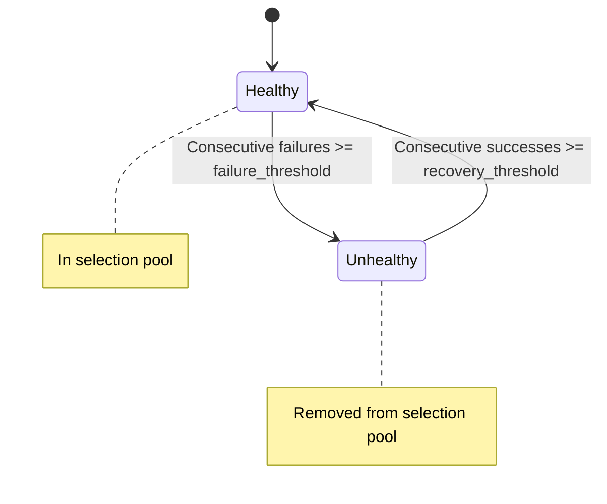

# L4 Load Balancer

> **Edition: OSS** | **eBPF Program: xdp-loadbalancer** | **Domain: loadbalancer**

## Overview

eBPFsentinel includes a built-in L4 load balancer for TCP, UDP, and TLS passthrough traffic. Incoming connections are distributed across backend pools using XDP for wire-speed packet redirection. Five balancing algorithms are supported, with per-backend health checks and weighted traffic distribution.

## How It Works

### Two-Layer Architecture

1. **Kernel-side (eBPF)** — An XDP program performs fast-path packet rewriting. In DNAT mode, destination IP/port is replaced with the selected backend and L3/L4 checksums are updated inline. In L2 DSR mode, only the destination MAC is rewritten and checksums are left untouched. Either way this happens before the kernel allocates an SKB, achieving maximum throughput.
2. **Userspace (LB Engine)** — Manages service definitions, runs backend selection algorithms, tracks connection counts for least-connections balancing, and processes health check results to mark backends healthy or unhealthy.

### Protocols

| Protocol | Behavior |
|----------|----------|
| **TCP** | Full L4 load balancing with connection tracking |
| **UDP** | Stateless per-packet distribution |
| **TLS Passthrough** | Forwards encrypted TLS traffic without termination — backends handle TLS |

### Balancing Algorithms

| Algorithm | Description |
|-----------|-------------|
| **Round Robin** | Per-service index cycles through healthy backends sequentially |
| **Weighted** | Cumulative weight distribution — higher weight = more traffic |
| **IP Hash** | FNV-1a hash of client address for sticky sessions |
| **Least Connections** | Selects the healthy backend with the fewest active connections |
| **Maglev** | Consistent hashing via a precomputed permutation ring (prime size 65537). O(1) lookup with no per-packet state; only ~1/N flows are remapped when the backend set changes. Deterministic across nodes — required for L2 DSR / multi-node ECMP. |

### Forwarding Modes

The selected backend is reached using one of two forwarding modes, set per service via the `mode` field. The forwarding mode is orthogonal to the balancing algorithm — backend selection is identical in both modes; only the L2/L3 rewrite differs.

| Mode | Value | Behavior |
|------|-------|----------|
| **DNAT** | `dnat` (default) | Destination IP/port are rewritten to the selected backend and L3/L4 checksums are recomputed inline. Works across L3 boundaries. This is the default and is unchanged from prior releases. |
| **L2 DSR** | `l2dsr` | Direct Server Return (LVS-DR style). Only the destination MAC is rewritten to the backend's resolved MAC; the destination IP stays the VIP and **no L3/L4 checksum recompute** occurs. The backend (with the VIP bound on loopback) replies directly to the client, bypassing the load balancer on the return path. |

L2 DSR requirements:

- Every backend in an `l2dsr` service must be on the **same L2 segment** as the load balancer and flagged with `same_segment: true`. Configuration is rejected with a clear error otherwise.
- Backend MACs are resolved by userspace (neighbor / ARP for IPv4, ND for IPv6) and pushed into the `LB_BACKEND_MAC` eBPF map. If a backend MAC cannot be resolved, that packet **falls back to the DNAT path** automatically — no traffic is dropped due to an unresolved MAC.
- The backend must have the VIP configured (typically on a loopback alias) and must suppress ARP for the VIP.

### Backend Health Checks

Optional per-service health probes monitor backend availability:

- **Protocols**: TCP connect or ICMP ping
- **Configurable intervals**: probe frequency, timeout, failure/recovery thresholds
- **State transitions**: backends transition between `healthy` and `unhealthy` based on consecutive probe results



### Engine Limits

- Maximum 64 services
- Maximum 16 backends per service (eBPF map constraint)
- Backend IDs and service IDs: max 64 characters

## Configuration

```yaml
loadbalancer:
  enabled: true
  services:
    - id: lb-https
      name: web-https
      protocol: tls_passthrough
      listen_port: 443
      algorithm: round_robin
      mode: dnat                # dnat (default) or l2dsr
      enabled: true
      backends:
        - id: web-1
          addr: "10.0.1.10"
          port: 443
          weight: 1
          enabled: true
          same_segment: false   # must be true for every backend of an l2dsr service
        - id: web-2
          addr: "10.0.1.11"
          port: 443
          weight: 1
          enabled: true
      health_check:
        protocol: tcp           # tcp or http; probes each backend's addr:port
        interval_secs: 10
        timeout_secs: 5
        failure_threshold: 3    # alias of unhealthy_threshold
        recovery_threshold: 2   # alias of healthy_threshold
```

See [Configuration: Load Balancer](../configuration/loadbalancer.md) for the full reference.

## CLI Usage

```bash
# View load balancer status (enabled, service count)
ebpfsentinel-agent lb status

# List all services
ebpfsentinel-agent lb services

# View a specific service (backends, health, connections)
ebpfsentinel-agent lb service lb-https

# Add a service from inline JSON
ebpfsentinel-agent lb add --json '{
  "id": "lb-api",
  "name": "api-pool",
  "protocol": "tcp",
  "listen_port": 8080,
  "algorithm": "least_conn",
  "backends": [
    {"id": "api-1", "addr": "10.0.1.20", "port": 8080, "weight": 1},
    {"id": "api-2", "addr": "10.0.1.21", "port": 8080, "weight": 1}
  ]
}'

# Delete a service by ID
ebpfsentinel-agent lb delete lb-api

# JSON output for scripting
ebpfsentinel-agent --output json lb status
ebpfsentinel-agent --output json lb services
```

## REST API

| Method | Path | Description |
|--------|------|-------------|
| GET | `/api/v1/lb/status` | Load balancer status (enabled, service count) |
| GET | `/api/v1/lb/services` | List all services with summary |
| GET | `/api/v1/lb/services/{id}` | Service detail with backends, health status, connections |
| POST | `/api/v1/lb/services` | Create a service (requires `admin` role) |
| DELETE | `/api/v1/lb/services/{id}` | Delete a service (requires `admin` role) |

## Code Architecture

| Crate | Path | Role |
|-------|------|------|
| `ebpf-programs` | `crates/ebpf-programs/xdp-loadbalancer/` | XDP kernel-side packet rewriting |
| `ebpf-common` | `crates/ebpf-common/src/loadbalancer.rs` | Shared `#[repr(C)]` types (service/backend map entries) |
| `domain` | `crates/domain/src/loadbalancer/` | LB engine (entity, engine, error) — selection algorithms + health |
| `ports` | `crates/ports/src/secondary/loadbalancer_map_port.rs` | eBPF map port trait |
| `application` | `crates/application/src/lb_service_impl.rs` | App service (engine + eBPF sync) |
| `adapters` | `crates/adapters/src/ebpf/lb_map_manager.rs` | eBPF map adapter |
| `adapters` | `crates/adapters/src/http/lb_handler.rs` | HTTP handler (5 endpoints) |
| `infrastructure` | `crates/infrastructure/src/config/loadbalancer.rs` | Config parsing |

## Event Pipeline Integration

The load balancer eBPF program emits events via RingBuf, consumed by an `EventReader` in userspace. Events are dispatched through the packet pipeline and recorded as metrics:

| Action | Description |
|--------|-------------|
| `forward` | Packet successfully rewritten and forwarded to a backend |
| `no_backend` | No healthy backend available — packet dropped |

Per-CPU metrics are collected via a `MetricsReader` on the `LB_METRICS` PerCpuArray map.

### IPv6 Support

Full dual-stack support: both IPv4 and IPv6 packets are load-balanced with correct L4 checksum updates. IPv6 DNAT updates the TCP/UDP pseudo-header checksum incrementally (8 × u16 words for the 128-bit address diff + port diff).

## L2 VIP announcer

For a virtual IP (VIP) to be reachable on a flat L2 segment, some node
must answer ARP "who-has" requests for it. The L2 VIP announcer makes the
elected node claim ownership of one or more VIPs by answering ARP, and
re-announces ownership on failover with gratuitous ARP.

### How it works

- A small, **bounded** XDP path (fixed 28-byte ARP rewrite, no loop)
  runs as a separate tail-call target from the LB hot path. The
  `xdp-firewall` entry point dispatches ARP frames to it.
- When an ARP request targets an owned VIP **and** this node is the
  elected speaker, it forges an ARP reply (`sha` = this node's NIC MAC)
  and `XDP_TX`s it back out the receiving interface.
- The node's NIC MAC per interface is resolved in userspace and pushed
  into an `IFACE_MAC` map.
- While speaker, the agent also maintains a per-VIP **self-owned
  binding** (`VIP → MAC`) in a `SELF_OWNED_BINDINGS` map. The responder
  prefers this per-VIP MAC when forging the reply `sha` (multi-homed
  VIPs answer with the right MAC), falling back to `IFACE_MAC` when no
  binding is present. Every binding is removed on speaker loss, so a
  standby node owns nothing — split-brain safe.
- On speaker takeover the userspace agent emits one **gratuitous ARP**
  per owned VIP via a raw socket — a rare event, never done in eBPF.

### Single-speaker election (split-brain safe)

Election is **config-driven**: each node is explicitly `primary`
(speaker) or `standby`. The userspace agent populates the kernel
`VIP_SET` **only** while this node is the elected speaker; a `standby`
or `disabled` node always leaves `VIP_SET` empty, so it never answers
ARP and never emits gratuitous ARP. There is no gossip layer. A
Kubernetes `Lease`-based election is a documented seam but is not
implemented.

> Only IPv4 VIPs are announced (ARP is IPv4-only). IPv6 VIPs configured
> here are ignored by the announcer (Neighbor Discovery is out of scope).

See [Load Balancer configuration](../configuration/loadbalancer.md#l2-vip-announcer)
for the `announce` block.

## Metrics

- `ebpfsentinel_rules_loaded{domain="loadbalancer"}` — number of loaded services
- `ebpfsentinel_packets_total{domain="loadbalancer", action="forward"}` — packets forwarded to backends
- `ebpfsentinel_packets_total{domain="loadbalancer", action="no_backend"}` — packets with no available backend
- `ebpfsentinel_lb_vip_arp_replies_total{vip}` — forged ARP replies per VIP (speaker only)
- `ebpfsentinel_lb_vip_takeovers_total{vip}` — gratuitous-ARP takeovers per VIP
