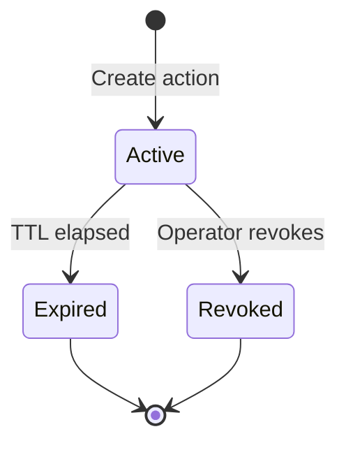

# Automated Response

> **Edition: OSS** | **Userspace Only**

## Overview

eBPFsentinel provides time-bounded incident response actions that automatically expire after a configurable TTL. Operators can manually block or throttle IPs via the API and CLI, or configure severity-based policies that trigger responses automatically when alerts fire. Every action has an expiration timestamp -- there are no permanent stale rules.

## Action Types

| Action | Serialized Value | Description |
|--------|-----------------|-------------|
| **Block IP** | `block_ip` | Add the target host to the IPS blacklist, which drops all of its traffic. Both IP families. |
| **Throttle IP** | `throttle_ip` | Give the target host a token bucket in the XDP rate limiter at `rate_pps` packets per second, with one second of burst. IPv4 targets only, since the rate limiter's per-source map is keyed by a 32-bit address. |

The target is a single host address. Both maps are keyed by one address, so a
prefix is refused rather than silently narrowed.

## How It Works

### Action Lifecycle



1. **Create** -- An action is registered with a target host address, action type, and TTL, and the blacklist entry or token bucket is installed
2. **Active** -- The blacklist entry or rate-limit bucket is in effect
3. **Expired** -- The TTL elapsed; the entry is lifted from the data plane and the action is cleaned up
4. **Revoked** -- An operator manually revoked the action before TTL expiry; the entry is lifted immediately

An action is considered inactive when `revoked == true` OR the current time has reached `expires_at_ns`. The engine periodically drains expired actions to free memory.

### TTL Management

TTL values are specified as human-readable duration strings:

| Format | Example | Seconds |
|--------|---------|---------|
| Seconds | `30s` or `30` | 30 |
| Minutes | `5m` | 300 |
| Hours | `1h` | 3,600 |
| Days | `1d` | 86,400 |

The maximum allowed TTL is configurable (default: 24 hours / 86,400 seconds). Requests exceeding the maximum are rejected.

Each active action tracks:

| Field | Description |
|-------|-------------|
| `ttl_secs` | Original TTL in seconds |
| `created_at_ns` | Creation timestamp (nanoseconds since epoch) |
| `expires_at_ns` | Computed expiration timestamp |
| `remaining_secs` | Seconds remaining (returned in API responses) |
| `rule_id` | Underlying blacklist or rate-limiter rule ID |

### Response Action Fields

| Field | Type | Required | Description |
|-------|------|----------|-------------|
| `action` | `string` | Yes | `block_ip` or `throttle_ip` |
| `target` | `string` | Yes | Host address (e.g. `1.2.3.4` or `2001:db8::1`) |
| `ttl` | `string` | Yes | Duration string (`30s`, `5m`, `1h`, `1d`, or bare seconds) |
| `rate_pps` | `integer` | Only for `throttle_ip` | Packets per second rate limit, above zero |

## Auto-Response

Automatic block or throttle of source IPs when alerts match severity-based policies. Up to 3 policies in OSS. Policies are evaluated on every alert that names a source address: IDS, threat intelligence, DDoS, and the packet-level components (firewall, ratelimit, L7, IPS).

### Policy Fields

| Field | Type | Default | Description |
|-------|------|---------|-------------|
| `name` | `string` | Required | Policy name, non-empty and unique (used in logs, metrics and the throttle's rule ID) |
| `min_severity` | `string` | `high` | Minimum alert severity: `low`, `medium`, `high`, `critical` |
| `components` | `[string]` | `[]` (all) | Component filter, one or more of `ai-security`, `ddos`, `firewall`, `ids`, `ips`, `l7`, `ratelimit`, `threatintel` |
| `action` | `string` | `block` | `block` (deny, both IP families) or `throttle` (rate limit, IPv4 sources only) |
| `ttl_secs` | `integer` | `3600` | Duration of the block/throttle in seconds |
| `rate_pps` | `integer` | -- | Packets per second, required above zero on a `throttle` |

### How Auto-Response Works

1. An alert is created (IDS pattern match, DDoS detection, threat-intel hit, firewall deny, etc.)
2. An alert that names no source address is skipped: nothing can be contained for it
3. Each policy is evaluated in order -- first match wins (no stacking)
4. If `min_severity` matches and `components` matches (or is empty = all), the source IP is blocked or throttled
5. The block/throttle has a bounded TTL and auto-expires
6. Every action is logged with policy name, alert ID, source IP, and TTL

## CLI Usage

```bash
# Block an IP for 1 hour
ebpfsentinel-agent responses create --action block_ip --target 1.2.3.4 --ttl 1h

# Throttle an IP for 30 minutes at 10 pps
ebpfsentinel-agent responses create --action throttle_ip --target 1.2.3.4 --ttl 30m --rate-pps 10

# List active response actions
ebpfsentinel-agent responses list

# Revoke an action early
ebpfsentinel-agent responses revoke resp-1234
```

## API Endpoints

| Method | Endpoint | Description |
|--------|----------|-------------|
| `POST` | `/api/v1/responses/manual` | Create a time-bounded response action |
| `GET` | `/api/v1/responses` | List active response actions |
| `DELETE` | `/api/v1/responses/{id}` | Revoke a response action early |

All endpoints require authentication (Bearer JWT, OIDC, or API key).

See the full [API reference](../api-reference/rest-api.md#responses) for request/response schemas.

## Limits (OSS vs Enterprise)

| | OSS | Enterprise |
|---|---|---|
| Max auto-response policies | 3 | Unlimited |
| Conditions | Severity + components | + MITRE ATT&CK tactic/technique |
| Actions | block, throttle | + flow isolation, SOAR webhooks |
| Cooldown | No (first match per alert) | Per (policy, source IP) with configurable cooldown |
| Audit trail | Log output only | Queryable audit trail via API |

## Configuration

See [Auto-Response Configuration](../configuration/auto-response.md) for the full YAML reference.
