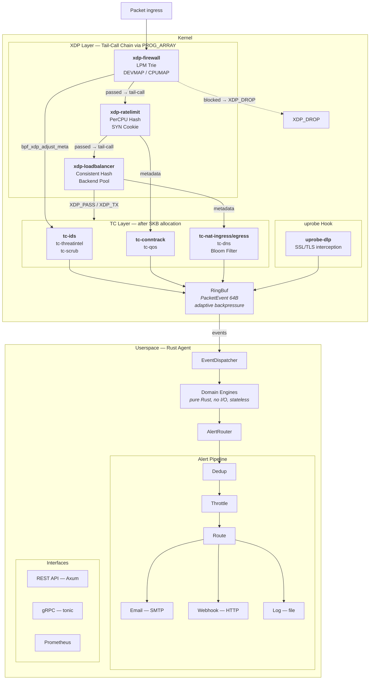

# Core Concepts

## Architecture at a Glance

eBPFsentinel is a single binary that runs two layers:

1. **Kernel-space eBPF programs** — attached at XDP, TC, and uprobe hook points for wire-speed packet processing
2. **Userspace Rust agent** — receives events via RingBuf, runs domain engines, serves the REST/gRPC API



## eBPF Hook Points

eBPFsentinel uses three types of eBPF hooks:

| Hook | Speed | Use Case | Programs |
|------|-------|----------|----------|
| **XDP** (eXpress Data Path) | Fastest — before the kernel network stack | Firewall, rate limiting, load balancing | `xdp-firewall`, `xdp-ratelimit`, `xdp-loadbalancer` |
| **TC** (Traffic Control) | Fast — after SKB allocation | IDS, threat intel, DNS, conntrack, NAT, QoS, DDoS scrubbing | `tc-ids`, `tc-threatintel`, `tc-dns`, `tc-conntrack`, `tc-nat-ingress`, `tc-nat-egress`, `tc-qos`, `tc-scrub` |
| **uprobe** | Per-function call | SSL/TLS interception for DLP | `uprobe-dlp` |

XDP programs can **drop, pass, redirect, or tail-call** into other XDP programs. The firewall tail-calls into the rate limiter via `PROG_ARRAY`, meaning only one XDP program needs to be attached per interface.

XDP supports three attachment modes: **native** (fastest — runs in the NIC driver), **generic** (universal — runs after SKB allocation), and **offloaded** (runs on SmartNIC hardware). The mode is configurable via [`agent.xdp_mode`](../configuration/agent.md#xdp-attachment-mode). Default is `auto` (kernel picks best available).

## Tail-Call Chaining

The XDP programs are chained via tail calls through a `PROG_ARRAY`:

```
Packet → xdp-firewall → (if passed) → xdp-ratelimit → xdp-loadbalancer → XDP_PASS/XDP_TX
                       → (if blocked) → XDP_DROP
```

This avoids attaching multiple XDP programs to the same interface and eliminates redundant packet parsing.

## XDP→TC Metadata Passing

When an XDP program passes a packet, it writes metadata (matched rule ID, flags) using `bpf_xdp_adjust_meta`. Downstream TC programs read this metadata without re-parsing the packet headers.

## RingBuf Events

All eBPF programs emit events to userspace via BPF ring buffers. The `PacketEvent` structure is 64 bytes and includes:

- Source/destination addresses (IPv4 or IPv6)
- Source/destination ports
- Protocol, flags (`FLAG_IPV6`, `FLAG_VLAN`)
- VLAN ID, CPU ID, timestamp

The ring buffer implements **adaptive backpressure** — when the buffer exceeds 75% capacity (`bpf_ringbuf_query`), programs skip event emission to prevent userspace from falling behind.

## Domain Engines

Each security domain has a pure Rust engine with no I/O, no async, and no side effects:

| Engine | Input | Output |
|--------|-------|--------|
| Firewall | Packet headers + rules | Allow/Deny/Log decision |
| IDS | Packet payload + signatures | Alert with severity |
| IPS | IDS alert + blacklist | Block decision |
| DLP | Decrypted payload + patterns | Data leak alert |
| Rate Limiter | Source IP + policy | Allow/Throttle decision |
| Threat Intel | IP/domain + IOC database | Match + action |
| L7 Firewall | Parsed L7 fields + rules | Allow/Deny decision |
| DNS Intelligence | DNS query/response + blocklist | Allow/Block + cache update |
| DDoS | SYN/UDP/ICMP flood metrics | SYN cookie / drop decision |
| Load Balancer | TCP/UDP flow + backend pool | Backend selection + redirect |
| NAT | Packet + NAT rules (SNAT/DNAT/NPTv6) | Address translation decision |
| QoS | Packet + classifier rules | Queue assignment + shaping |
| Conntrack | Packet + connection table | State tracking (new/established/related) |
| Routing | Packet + policy routes | Next-hop / interface decision |
| Zone | Packet + zone membership | Inter-zone policy enforcement |

Engines are stateless functions: they take input and return a decision. State (blacklists, caches, counters) is managed by the application layer.

## Hexagonal / DDD Architecture

The codebase follows strict dependency rules:

```
domain ← ports ← application
                ← infrastructure
                ← adapters ← agent (binary)
```

- **domain** — pure business logic, depends on nothing, `#![forbid(unsafe_code)]`
- **ports** — trait definitions consumed and implemented by adapters
- **application** — orchestrates domain engines via port traits
- **infrastructure** — config parsing, logging, metrics setup
- **adapters** — HTTP, gRPC, eBPF, redb storage implementations
- **agent** — binary entry point, wires everything together

This means the domain logic is fully testable without any infrastructure, eBPF, or network code.

## Interface Groups

Rules across multiple domains (firewall, NAT, IDS, rate limiting, QoS) can be scoped to specific **interface groups**. Define named groups of interfaces at the top level, then reference group names in the `interfaces` field on individual rules:

```yaml
interface_groups:
  lan:
    interfaces: [eth0, eth1]
  wan:
    interfaces: [eth2]

firewall:
  rules:
    - id: wan-only-rule
      action: deny
      interfaces: [wan]        # Only applies on WAN interfaces
    - id: not-wan
      action: allow
      interfaces: ["!wan"]     # Applies everywhere EXCEPT WAN
    - id: floating-rule
      action: allow
      dst_port: 53             # No interfaces = floating (all interfaces)
```

Rules without an `interfaces` field are **floating rules** and apply to all interfaces (backward compatible). Up to 31 groups are supported. In eBPF, interface membership is stored as a u32 bitmask and checked with a single AND + compare per rule.

## Configuration

Single YAML file with optional per-feature sections. Only `agent.interfaces` is required:

```yaml
agent:
  interfaces: [eth0]    # Everything else is optional
```

**Precedence:** CLI flags > environment variables > YAML file > defaults

The agent supports **hot reload** — configuration changes are applied without restart via SIGHUP, file watching, or the REST API.

## Authentication Model

Three authentication methods, combinable:

| Method | Use Case | Configuration |
|--------|----------|---------------|
| **API Keys** | Static tokens for automation | `auth.api_keys` list |
| **JWT (RS256)** | Service-to-service with PKI | `auth.jwt` with public key |
| **OIDC (JWKS)** | SSO integration | `auth.oidc` with discovery URL |

RBAC roles: `admin` (full access), `operator` (namespace-scoped writes), `viewer` (read-only).

## Alert Pipeline

```
Domain Engine → AlertRouter → Dedup → Throttle → Route → Destination
                                                          ├── Email (SMTP)
                                                          ├── Webhook (HTTP)
                                                          └── Log (file)
```

Each route specifies a `destination` type (`log`, `email`, or `webhook`) and a `min_severity` threshold. Alerts flow through deduplication (suppress duplicate alerts within a window), throttling (rate-limit per source), severity-based routing, and circuit breakers (back off if a sender is down).

## Next Steps

- [Feature Overview](../features/overview.md) — see what each domain does
- [Architecture Overview](../architecture/overview.md) — deep dive into the codebase
- [Configuration Overview](../configuration/overview.md) — configure the agent
