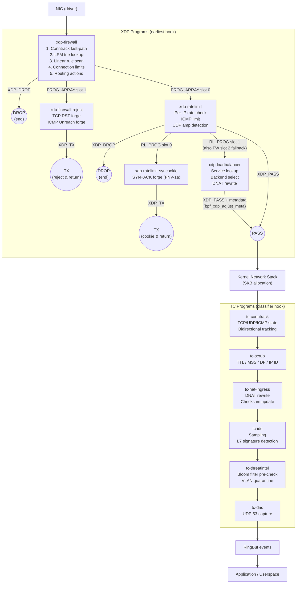
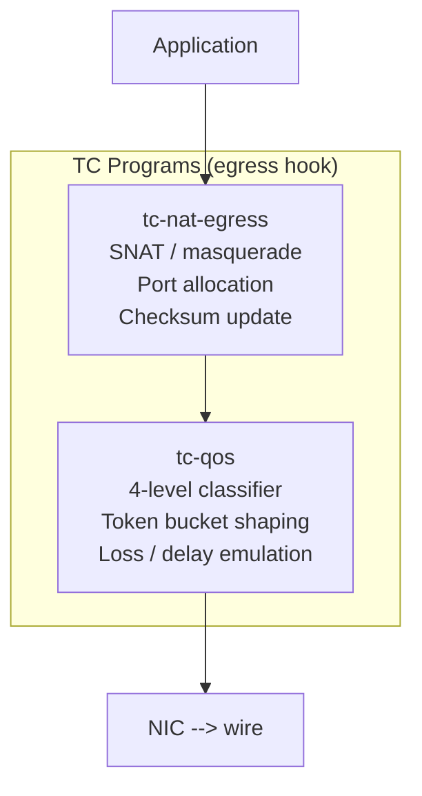
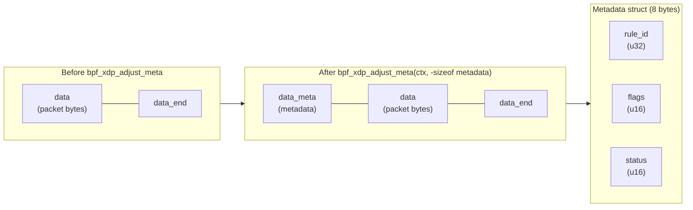
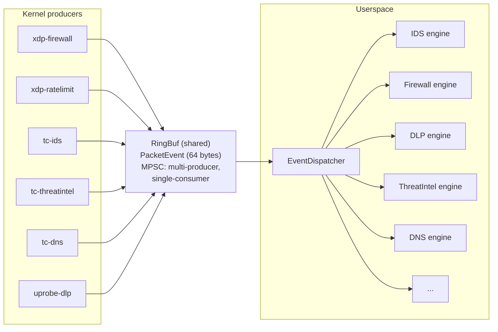

# Packet Pipeline

The full kernel-side packet processing pipeline, from NIC to userspace.

## Ingress Pipeline



## Egress Pipeline



## XDP→TC Metadata Flow

The XDP firewall uses [`bpf_xdp_adjust_meta`](https://docs.ebpf.io/linux/helper-function/bpf_xdp_adjust_meta/) to pass context to downstream TC programs:



TC programs access `ctx->data_meta` directly without re-parsing Ethernet/IP/TCP headers, saving ~50ns per packet.

## RingBuf Event Flow

All kernel programs emit events to userspace via the same [`BPF_MAP_TYPE_RINGBUF`](https://docs.ebpf.io/linux/map-type/BPF_MAP_TYPE_RINGBUF/):



### PacketEvent Structure (64 bytes)

The standard event type emitted by all programs:

```
Offset  Field            Type             Notes
──────  ───────────────  ───────────────  ──────────────────────────
 0      timestamp_ns     u64 (8 B)        bpf_ktime_get_boot_ns()
 8      src_addr         [u32; 4] (16 B)  IPv4: [addr, 0, 0, 0]
                                          IPv6: [a, b, c, d]
24      dst_addr         [u32; 4] (16 B)
40      src_port         u16 (2 B)
42      dst_port         u16 (2 B)
44      protocol         u8  (1 B)        6=TCP, 17=UDP, 1=ICMP
45      event_type       u8  (1 B)        0=FW, 1=IDS, 7=DNS, ...
46      action           u8  (1 B)        pass / drop / log
47      flags            u8  (1 B)        FLAG_IPV6, FLAG_VLAN
48      rule_id          u32 (4 B)        matched rule ID (0 = none)
52      vlan_id          u16 (2 B)        802.1Q VLAN ID (0 = none)
54      cpu_id           u16 (2 B)        bpf_get_smp_processor_id()
56      socket_cookie    u64 (8 B)        bpf_get_socket_cookie()
──────
Total: 64 bytes, #[repr(C)], aligned to 8 bytes
```

### Backpressure

IDS and threat intel programs check ring buffer fill level before emitting:

```
avail = bpf_ringbuf_query(&EVENTS, BPF_RB_AVAIL_DATA)
if avail > capacity * 75 / 100:
    metrics[EVENTS_DROPPED] += 1
    return TC_ACT_OK          // skip event, pass packet
```

This prevents kernel-side event buildup when the userspace consumer is slow, avoiding memory pressure and latency spikes.

## Map Sharing (BPF Filesystem Pinning)

Several maps are shared across programs via BPF filesystem pinning (`/sys/fs/bpf/`):

| Map | Writer | Reader | Purpose |
|-----|--------|--------|---------|
| Conntrack table | tc-conntrack | xdp-firewall | Fast-path lookup for ESTABLISHED connections |
| Per-source counters | tc-conntrack | xdp-firewall | Connection limit enforcement |
| Firewall LPM tries | Userspace | xdp-firewall | Rule updates without program reload |
| Rate limit configs | Userspace | xdp-ratelimit | Policy changes |
| Threat intel Bloom | Userspace | tc-threatintel | Feed refresh |
| IPS blacklist | Userspace | xdp-firewall | Auto-block from IPS engine |
