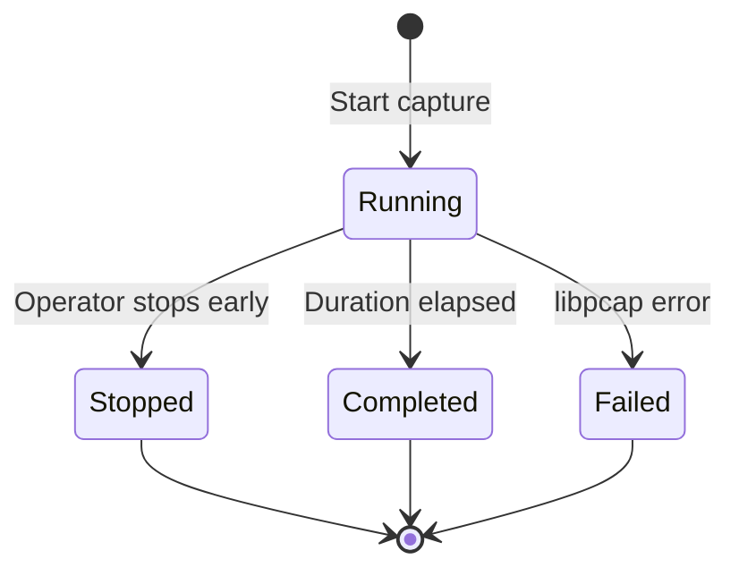

# Packet Capture

> **Edition: OSS** | **Status: Shipped** | **Userspace Only** (libpcap)

## Overview

eBPFsentinel provides on-demand and alert-triggered packet capture to standard PCAP files. Captures are time-bounded, single-session, and compatible with Wireshark, tcpdump, and Zeek. The capture engine enforces a single-active-capture constraint to prevent resource exhaustion.

## How It Works

### Session Lifecycle

A capture session moves through the following states:



| Status | Description |
|--------|-------------|
| **Running** | Capture is actively recording packets via libpcap |
| **Completed** | Duration elapsed normally; final packet count and file size recorded |
| **Stopped** | Operator stopped the capture early via API or CLI |
| **Failed** | libpcap error (device not found, BPF compilation failure, etc.) |

Only one session can be in the `Running` state at any time. Starting a second capture while one is active returns HTTP 409 Conflict.

### Capture Parameters

| Parameter | Type | Default | Description |
|-----------|------|---------|-------------|
| `filter` | `string` | `""` (all traffic) | BPF filter expression (e.g. `host 1.2.3.4 and port 443`) |
| `duration_seconds` | `integer` | Required | Maximum capture duration in seconds |
| `snap_length` | `integer` | `1500` | Maximum bytes captured per packet |
| `interface` | `string` | `any` | Network interface to capture on |

### Validation

The API enforces the following constraints before starting a capture:

- **BPF filter length**: Maximum 2048 characters
- **BPF filter content**: No control characters (NUL, CR, LF, etc.) except spaces
- **BPF filter syntax**: Compiled by libpcap at capture start; invalid syntax causes the session to fail
- **Interface name**: 1-15 characters, alphanumeric plus `_`, `-`, `.`, `:`; or the special value `any`
- **Duration**: Must not exceed the configured maximum (default: 300 seconds)
- **Single active capture**: Only one running session at a time

### Output

Capture files are written to `/var/lib/ebpfsentinel/captures/` as standard PCAP format:

- Manual captures: `cap-{timestamp_ms}.pcap`
- Auto-captures: `auto-{timestamp_ms}.pcap`

On completion, the session records the final `file_size_bytes` and `packets_captured` for API queries.

## Auto-Capture

Automatically start a packet capture when a high-severity alert fires. The BPF filter is auto-generated from the alert's source IP (`host {src_ip}`). The single-active-capture constraint still applies -- if a capture is already running, the trigger is silently skipped.

### Policy Fields

Each auto-capture policy defines:

| Field | Type | Default | Description |
|-------|------|---------|-------------|
| `name` | `string` | Required | Policy name (used in logs) |
| `min_severity` | `string` | `high` | Minimum alert severity: `low`, `medium`, `high`, `critical` |
| `components` | `[string]` | `[]` (all) | Component filter: `ids`, `ddos`, `dns`, `dlp`, `firewall`, etc. |
| `duration_secs` | `integer` | `30` | Capture duration (max 60s in OSS) |
| `snap_length` | `integer` | `1500` | Max bytes per packet |
| `interface` | `string` | First agent interface | Network interface |

### How Auto-Capture Works

1. An alert fires from any detection engine (IDS, DLP, DDoS, DNS, packet security)
2. If severity >= `min_severity` and the component matches, a capture is triggered
3. If another capture is already running, the trigger is skipped (no stacking)
4. A BPF filter `host {source_ip}` is auto-generated from the alert
5. A `.pcap` file is written to `/var/lib/ebpfsentinel/captures/auto-{timestamp}.pcap`
6. The capture auto-stops after `duration_secs`

## CLI Usage

```bash
# Start a 60-second capture with a BPF filter
ebpfsentinel-agent capture start --filter "host 1.2.3.4" --duration 60s --snap-length 1500

# Stop a running capture
ebpfsentinel-agent capture stop cap-1234

# List all capture sessions (active and historical)
ebpfsentinel-agent capture list
```

## API Endpoints

| Method | Endpoint | Description |
|--------|----------|-------------|
| `POST` | `/api/v1/captures/manual` | Start a time-bounded packet capture |
| `GET` | `/api/v1/captures` | List all capture sessions |
| `DELETE` | `/api/v1/captures/{id}` | Stop a running capture |

All endpoints require authentication (Bearer JWT, OIDC, or API key).

See the full [API reference](../api/captures.md) for request/response schemas.

## Limits (OSS vs Enterprise)

| | OSS | Enterprise |
|---|---|---|
| Concurrent captures | 1 | Multiple + ring buffer |
| Max duration | 60s (auto-capture) | Unlimited |
| BPF filter | Manual or auto-generated from alert | Customizable per policy |
| Trigger | Severity + components | + MITRE tactic, custom conditions |
| Output | `.pcap` file | + flow timeline, forensics API |

## Configuration

See [Auto-Capture Configuration](../configuration/auto-capture.md) for the full YAML reference.

## Build Requirements

Packet capture requires `libpcap-dev` at build time and is gated behind the `pcap-capture` Cargo feature (enabled by default). Without it, capture sessions are registered but no actual packets are recorded.
