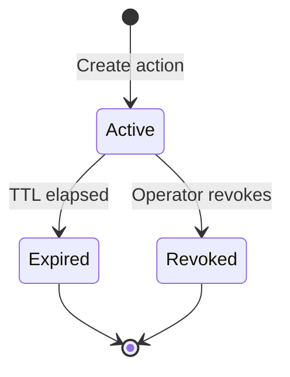

# Automated Response

> **Edition: OSS** | **Status: Shipped** | **Userspace Only**

## Overview

eBPFsentinel provides time-bounded incident response actions that automatically expire after a configurable TTL. Operators can manually block or throttle IPs via the API and CLI, or configure severity-based policies that trigger responses automatically when alerts fire. Every action has an expiration timestamp -- there are no permanent stale rules.

## Action Types

| Action | Serialized Value | Description |
|--------|-----------------|-------------|
| **Block IP** | `block_ip` | Create a temporary firewall deny rule for an IP or CIDR. Traffic is dropped at the IPS blacklist level. |
| **Throttle IP** | `throttle_ip` | Apply a temporary rate limit to an IP or CIDR. Requires a `rate_pps` (packets per second) value. |

## How It Works

### Action Lifecycle



1. **Create** -- An action is registered with a target IP/CIDR, action type, and TTL
2. **Active** -- The underlying firewall deny rule or rate limit is in effect
3. **Expired** -- The TTL elapsed; the action is automatically cleaned up
4. **Revoked** -- An operator manually revoked the action before TTL expiry

An action is considered inactive when `revoked == true` OR the current time has reached `expires_at_ns`. The engine periodically drains expired actions to free memory.

### TTL Management

TTL values are specified as human-readable duration strings:

| Format | Example | Seconds |
|--------|---------|---------|
| Seconds | `30s` or `30` | 30 |
| Minutes | `5m` | 300 |
| Hours | `1h` | 3,600 |
| Days | `1d` | 86,400 |

The maximum allowed TTL is configurable (default: 24 hours / 86,400 seconds). Requests exceeding the maximum are rejected.

Each active action tracks:

| Field | Description |
|-------|-------------|
| `ttl_secs` | Original TTL in seconds |
| `created_at_ns` | Creation timestamp (nanoseconds since epoch) |
| `expires_at_ns` | Computed expiration timestamp |
| `remaining_secs` | Seconds remaining (returned in API responses) |
| `rule_id` | Underlying firewall or rate-limiter rule ID |

### Response Action Fields

| Field | Type | Required | Description |
|-------|------|----------|-------------|
| `action` | `string` | Yes | `block_ip` or `throttle_ip` |
| `target` | `string` | Yes | IP address or CIDR (e.g. `1.2.3.4` or `10.0.0.0/24`) |
| `ttl` | `string` | Yes | Duration string (`30s`, `5m`, `1h`, `1d`, or bare seconds) |
| `rate_pps` | `integer` | Only for `throttle_ip` | Packets per second rate limit |

## Auto-Response

Automatic block or throttle of source IPs when alerts match severity-based policies. Up to 3 policies in OSS. Policies are evaluated on every alert from any detection engine (IDS, DLP, DDoS, DNS, packet security).

### Policy Fields

| Field | Type | Default | Description |
|-------|------|---------|-------------|
| `name` | `string` | Required | Policy name (used in logs) |
| `min_severity` | `string` | `high` | Minimum alert severity: `low`, `medium`, `high`, `critical` |
| `components` | `[string]` | `[]` (all) | Component filter: `ids`, `ddos`, `dns`, `dlp`, `firewall`, etc. |
| `action` | `string` | `block` | `block` (deny) or `throttle` (rate limit) |
| `ttl_secs` | `integer` | `3600` | Duration of the block/throttle in seconds |
| `rate_pps` | `integer` | -- | Packets per second (only for `throttle`) |

### How Auto-Response Works

1. An alert is created (IDS pattern match, DDoS detection, DNS blocklist hit, DLP violation, etc.)
2. Each policy is evaluated in order -- first match wins (no stacking)
3. If `min_severity` matches and `components` matches (or is empty = all), the source IP is blocked or throttled
4. The block/throttle has a bounded TTL and auto-expires
5. Every action is logged with policy name, alert ID, source IP, and TTL

## CLI Usage

```bash
# Block an IP for 1 hour
ebpfsentinel-agent responses create --action block_ip --target 1.2.3.4 --ttl 1h

# Throttle a CIDR for 30 minutes at 10 pps
ebpfsentinel-agent responses create --action throttle_ip --target 10.0.0.0/24 --ttl 30m --rate-pps 10

# List active response actions
ebpfsentinel-agent responses list

# Revoke an action early
ebpfsentinel-agent responses revoke resp-1234
```

## API Endpoints

| Method | Endpoint | Description |
|--------|----------|-------------|
| `POST` | `/api/v1/responses/manual` | Create a time-bounded response action |
| `GET` | `/api/v1/responses` | List active response actions |
| `DELETE` | `/api/v1/responses/{id}` | Revoke a response action early |

All endpoints require authentication (Bearer JWT, OIDC, or API key).

See the full [API reference](../api/responses.md) for request/response schemas.

## Limits (OSS vs Enterprise)

| | OSS | Enterprise |
|---|---|---|
| Max auto-response policies | 3 | Unlimited |
| Conditions | Severity + components | + MITRE ATT&CK tactic/technique |
| Actions | block, throttle | + flow isolation, SOAR webhooks |
| Cooldown | No (first match per alert) | Per (policy, source IP) with configurable cooldown |
| Audit trail | Log output only | Queryable audit trail via API |

## Configuration

See [Auto-Response Configuration](../configuration/auto-response.md) for the full YAML reference.
