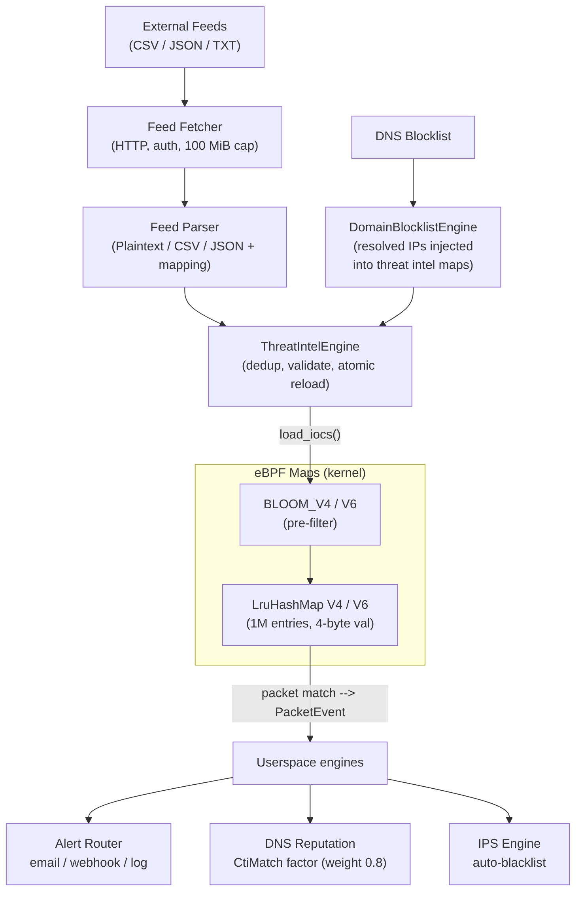

# Threat Intelligence

> **Edition: OSS** | **Status: Shipped** | **eBPF Program: tc-threatintel**

## Overview

Threat intelligence integrates external OSINT feeds into the packet processing pipeline for real-time IOC matching at wire speed. Feed configuration is **source-agnostic** — any provider that serves plaintext, CSV, or JSON data works through YAML field mappings, without any provider-specific code.

## Architecture

The threat intel system is **bidirectional**: external feeds flow down into the kernel, the kernel sends match events up to userspace, and userspace engines (DNS, reputation, IPS) can inject new IOCs back into the kernel maps.



## How It Works

### 1. Feed Ingestion

Feeds are fetched via HTTP/HTTPS on a configurable schedule (`refresh_interval_secs`). Each feed is independent — a failed fetch skips that feed without blocking others.

The fetcher enforces:
- **30-second timeout** per feed
- **100 MiB response cap** (prevents memory exhaustion)
- **Optional auth header** (e.g. `X-OTX-API-KEY: abc123`, `Authorization: Bearer ...`)
- **SSRF prevention** — only `http://` and `https://` schemes allowed

### 2. Feed Parsing (source-agnostic)

No provider-specific code. The parser dispatches by format, then uses `FieldMapping` to locate fields:

| Format | How IPs are extracted | Confidence | Category |
|--------|----------------------|------------|----------|
| `plaintext` | One IP per line, `#`-prefixed lines skipped | Always 100 | `other` |
| `csv` | Column by name (`ip_field`) or index, configurable separator | Column by name (`confidence_field`) or default 100 | Column by name (`category_field`) |
| `json` | JSON array, field name from `ip_field` | Field name from `confidence_field` | Field name from `category_field` |
| `stix` | Planned, not yet implemented | — | — |

Post-parse filters applied in order:
1. **`min_confidence`** — reject IOCs below this threshold (0 = accept all)
2. **`max_iocs`** — truncate if the feed returns too many entries (default: 500,000)

Category values are normalized: `"malware"/"mal"` → Malware, `"c2"/"c&c"/"botnet"` → C2, `"scanner"/"scan"` → Scanner, `"spam"` → Spam, anything else → Other.

### 3. Engine Storage (userspace)

The `ThreatIntelEngine` is a `HashMap<IpAddr, Ioc>` keyed by IP:

- **Deduplication**: if the same IP appears in multiple feeds, the highest-confidence entry wins
- **Atomic reload**: two-phase validation — all IOCs validated, then the entire map is swapped. On any error, the old map remains untouched
- **Capacity limit**: `max_iocs` per feed, 1M+ total across all feeds

### 4. Kernel Sync (userspace → eBPF)

When feeds are reloaded, the `ThreatIntelMapManager` syncs to 4 kernel maps:

| Map | Type | Entries | Purpose |
|-----|------|---------|---------|
| `THREATINTEL_IOCS` | LruHashMap | 1,048,576 | IPv4 IOC exact match (LRU eviction when full) |
| `THREATINTEL_IOCS_V6` | LruHashMap | 1,048,576 | IPv6 IOC exact match (LRU eviction when full) |
| `THREATINTEL_BLOOM_V4` | Bloom filter | 1,048,576 | IPv4 pre-filter (O(1), no false negatives) |
| `THREATINTEL_BLOOM_V6` | Bloom filter | 1,048,576 | IPv6 pre-filter |

Each IOC value in the map is 4 bytes: `{ action: u8, feed_id: u8, confidence: u8, threat_type: u8 }`.

The `action` field is set globally based on the mode:
- **`alert`** mode → `THREATINTEL_ACTION_ALERT (0)` → `TC_ACT_OK` (pass packet, emit event)
- **`block`** mode → `THREATINTEL_ACTION_DROP (1)` → `TC_ACT_SHOT` (drop packet, emit event)

### 5. Kernel Matching (tc-threatintel, hot path)

The TC classifier processes every ingress packet:

```
Packet arrives
    │
    ├── CONFIG_FLAGS[0] == 0 ? → bypass (TC_ACT_OK)
    │
    ├── Parse Ethernet + VLAN 802.1Q
    │
    ├── Bloom filter check on src_ip AND dst_ip
    │   └── Both negative ? → definitely no match, TC_ACT_OK
    │       (eliminates ~98% of traffic, zero LRU hash map lookups)
    │
    ├── Bloom positive → LRU hash map lookup for confirmation
    │   └── Not in LRU hash map ? → false positive, TC_ACT_OK
    │
    └── Match confirmed → apply action
        ├── ALERT → TC_ACT_OK + emit PacketEvent to RingBuf
        └── DROP  → TC_ACT_SHOT + emit PacketEvent to RingBuf
```

**Backpressure**: event emission is skipped when the RingBuf is >75% full, protecting the kernel hot path when userspace falls behind.

### 6. Cross-Domain Enrichment

Threat intel match events feed into other engines, creating a **feedback loop**:

#### DNS → Threat Intel (IP injection)

When the DNS blocklist engine detects a blocked domain resolving to an IP, that IP is **automatically injected into the threat intel kernel map**. This means:
- A domain blocklist entry like `*.malware.com` translates into real-time IP-level blocking
- IPs are managed with TTL awareness: injected when DNS resolves, removed when the DNS TTL expires (+grace period)
- The injection target is configurable: `ThreatIntel` (default), `Firewall`, or `Ips`

#### Threat Intel → Domain Reputation (scoring)

CTI matches contribute a `CtiMatch` reputation factor with **weight 0.8** into the domain reputation engine:
- Scoring uses probabilistic OR: `score = 1 - ∏(1 - weight_i)`
- Exponential decay: half-life 24 hours
- If effective score ≥ `auto_block_threshold` (default 0.8), the domain becomes an auto-block candidate

#### Threat Intel → IPS (blacklisting)

IPS blacklist additions for IPs involved in threat intel matches can be automated via the IPS engine.

#### GeoIP → Threat Intel (confidence boost)

The `country_confidence_boost` setting adjusts IOC confidence scores based on the source IP's country. Positive values increase confidence for IOCs from high-risk regions, making them more likely to trigger block actions:

```yaml
threatintel:
  country_confidence_boost:
    RU: 10       # +10 confidence for IOCs from Russia
    CN: 5        # +5 for China
    KP: 15       # +15 for North Korea
```

Values are clamped to the 0–100 range after adjustment. This is useful to prioritize IOCs from known high-risk regions when feeds have variable confidence scores.

## Configuration

```yaml
threatintel:
  enabled: true
  mode: alert          # "alert" or "block"

  feeds:
    # Plaintext — one IP per line
    - id: spamhaus-drop
      name: Spamhaus DROP
      url: https://www.spamhaus.org/drop/drop.txt
      format: plaintext
      comment_prefix: ";"
      refresh_interval_secs: 86400

    # CSV — custom field mapping
    - id: feodo-tracker
      name: Feodo Tracker Botnet C2
      url: https://feodotracker.abuse.ch/downloads/ipblocklist.csv
      format: csv
      ip_field: dst_ip
      category_field: malware
      separator: ","
      skip_header: true
      min_confidence: 75
      refresh_interval_secs: 1800
      default_action: block

    # JSON — with auth header
    - id: otx-malicious
      name: AlienVault OTX
      url: https://otx.alienvault.com/api/v1/indicators/export
      format: json
      ip_field: indicator
      confidence_field: pulse_count
      category_field: type
      auth_header: "X-OTX-API-KEY: your-key-here"
      refresh_interval_secs: 3600
      max_iocs: 100000
```

See [Configuration: Threat Intelligence](../configuration/threatintel.md) for the full field reference.

## Feed Security

Feed ingestion enforces several hardening measures to prevent abuse:

- **SSRF prevention** — feed URLs are resolved before connection and rejected if the resolved IP falls within private (RFC 1918), loopback (`127.0.0.0/8`), link-local (`169.254.0.0/16`, `fe80::/10`), or multicast ranges. Only `http://` and `https://` URL schemes are accepted.
- **No HTTP redirects** — the HTTP client does not follow redirects, preventing redirect-based SSRF bypass.
- **Auth header CRLF injection prevention** — the `auth_header` value is validated to reject carriage-return and line-feed characters, preventing HTTP header injection.
- **JSON depth limit** — JSON feed parsing enforces a maximum nesting depth of 64 levels to prevent stack exhaustion from deeply nested payloads.

## CLI Usage

```bash
# Feed status (last refresh time, IOC count, errors)
ebpfsentinel-agent threatintel status

# List loaded IOCs (all feeds)
ebpfsentinel-agent threatintel iocs

# List configured feeds
ebpfsentinel-agent threatintel feeds
```

## REST API

| Method | Path | Description |
|--------|------|-------------|
| GET | `/api/v1/threatintel/status` | Feed status (last refresh, IOC count per feed) |
| GET | `/api/v1/threatintel/iocs` | List loaded IOCs |
| GET | `/api/v1/threatintel/feeds` | List configured feeds |

## Code Architecture

| Crate | Path | Role |
|-------|------|------|
| `ebpf-common` | `crates/ebpf-common/src/threatintel.rs` | Shared `#[repr(C)]` types (keys, values, constants) |
| `ebpf-programs` | `crates/ebpf-programs/tc-threatintel/` | TC classifier: Bloom filter + LRU hash map lookup |
| `domain` | `crates/domain/src/threatintel/` | Engine (IOC store), parser (Plaintext/CSV/JSON), entities |
| `ports` | `crates/ports/src/secondary/threatintel_map_port.rs` | `ThreatIntelMapPort` trait (eBPF map writes) |
| `ports` | `crates/ports/src/secondary/feed_source.rs` | `FeedSource` trait (HTTP fetch) |
| `application` | `crates/application/src/threatintel_service_impl.rs` | App service (thin wrapper + metrics) |
| `application` | `crates/application/src/feed_update.rs` | Feed fetch orchestration + JSON parser |
| `adapters` | `crates/adapters/src/threatintel/http_feed_fetcher.rs` | `FeedSource` impl (reqwest, auth, size cap) |
| `adapters` | `crates/adapters/src/ebpf/threatintel_map_manager.rs` | `ThreatIntelMapPort` impl (HashMap + Bloom sync) |

## Metrics

- `ebpfsentinel_alerts_total{component="threatintel", severity}` — threat intel alerts generated
- `ebpfsentinel_rules_loaded{domain="threatintel"}` — total loaded IOC count
- `ebpfsentinel_processing_duration_seconds{domain="threatintel"}` — feed parse/reload latency
- `ebpfsentinel_config_reloads_total{status="success"|"failure"}` — per-feed fetch results
